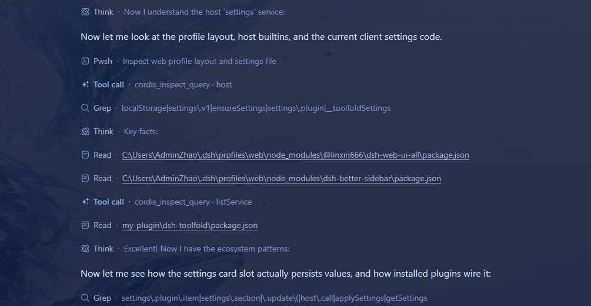
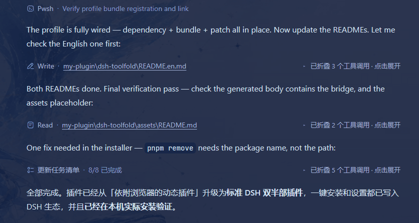
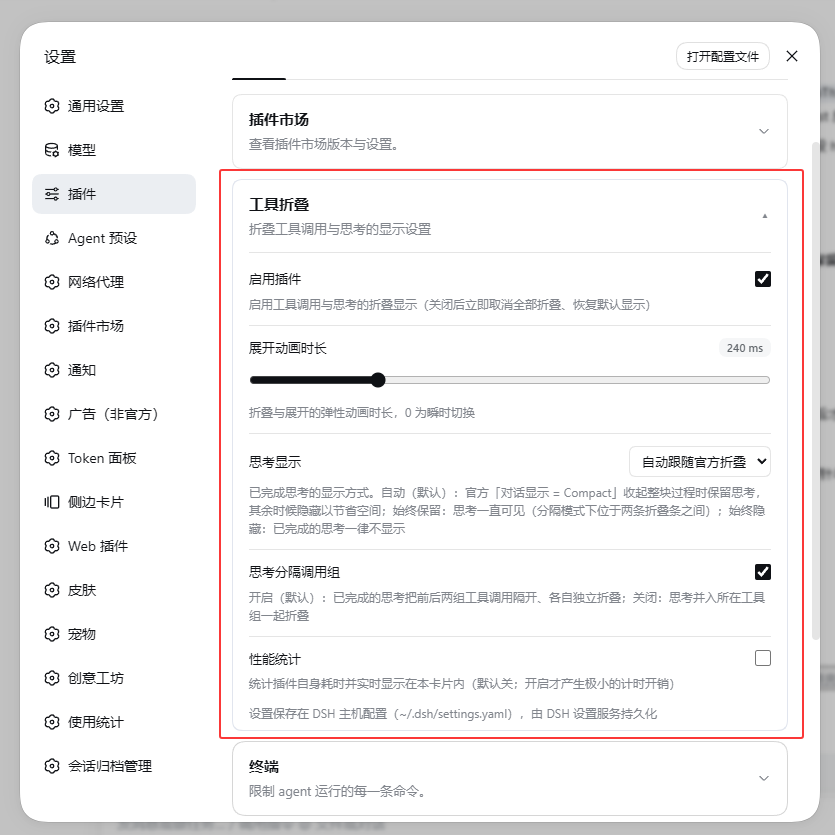
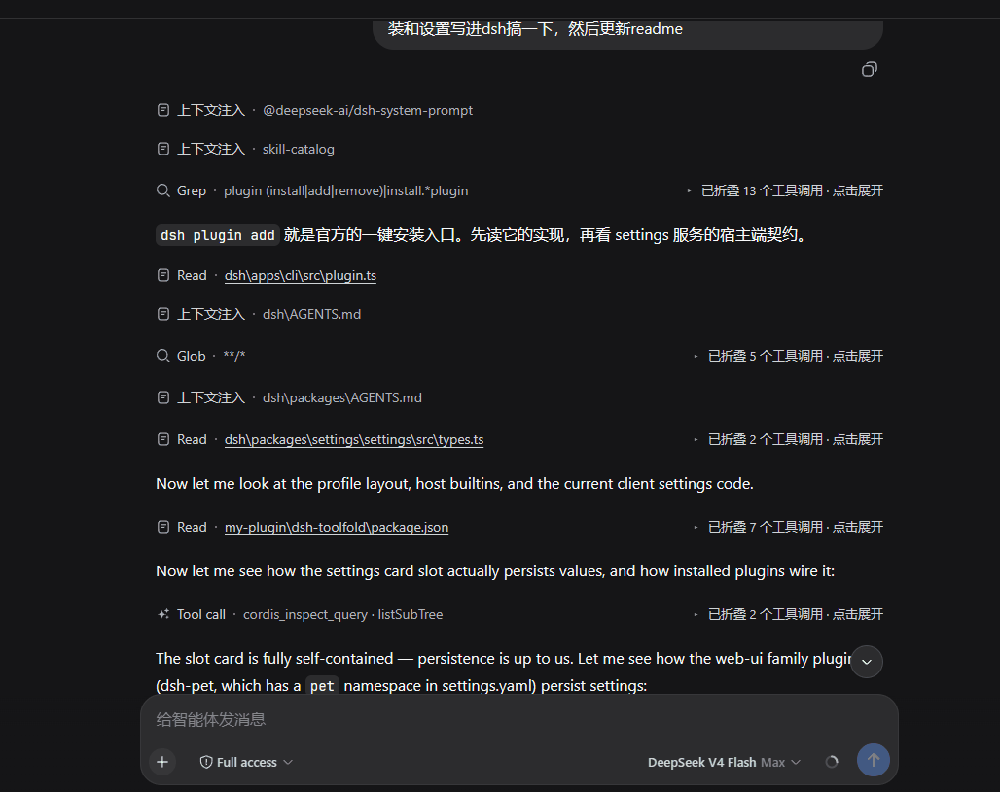

# dsh-toolfold · Tool Call Folding

[](https://awesome-dsh-plugin.com)

[中文](README.md) | English

> A DSH Web GUI plugin delivering a **Codex-like folding experience**: runs of consecutive
> **tool calls** fold into a single compact bar showing a one-line summary of the **last call** —
> click to expand/collapse. It replaces no built-in renderer, and uninstalling restores the UI
> completely.


<!-- 🖼️ IMAGE SLOT: assets/demo-fold.gif — record 6–10s: a run of tool calls auto-folds into one bar → click to expand (cards waterfall down) → click to collapse (cards rise, heights shrink), 16:9, ≤2MB -->

## Highlights

- **Runs of tool calls fold into one bar**: consecutive tool calls collapse into a single bar
  showing the **last call's** one-line summary, labelled "已折叠 N 个工具调用 · 点击展开"
  (N folded calls · click to expand);
- **Thinking separates call groups (default on)**: settled think blocks SPLIT the calls around
  them into independent bars — calls before and after a completed think never merge into one bar;
  turn it off to restore the original fold, where thinking folds WITH the surrounding tool group;
- **Thinking hidden by default, keepable**: settled think blocks are hidden outright by default;
  with "保留思考" enabled they never disappear — shown between the folded bars in split mode, or
  **re-inserted in their original order** between the calls on expand in merge mode;
- **In-progress thinking stays visible**: streaming think blocks render as their own row until
  they complete, then follow the "split thinking" setting;
- **Spring waterfall animations**: cards cascade down on expand (spring overshoot) and rise with a
  synchronized height shrink on collapse — content below follows continuously, no end snap;
  disabled automatically under `prefers-reduced-motion`;
- **Bottom-pinned expand**: expanding near the bottom pins the bar's viewport position, so the
  chat's auto-scroll never shoves it off the top of the screen;
- **Near-zero performance cost**: no page-wide observer, zero work while content streams, and
  everything pauses when the tab is hidden — measured ≈0.03% of one core while idle
  (see [Performance](#performance)).


<!-- 🖼️ IMAGE SLOT: assets/expand-collapse.gif — close-up of one 3–4 call run expanding (waterfall + label slide) and collapsing (rise + height shrink), square or 4:3, ≤2MB -->

## Installation

### Install from npm (recommended)
```sh
dsh plugin --profile web add dsh-toolfold
```

### Alternative installation methods

```sh
# Install from GitHub
dsh plugin --profile web add github:Minecraftbe/dsh-toolfold

# Or install from source
git clone https://github.com/Minecraftbe/dsh-toolfold.git
dsh plugin --profile web add ./dsh-toolfold
```

After installation, **restart dsh and refresh your browser** for the changes to take effect (the bundle layer is composed at startup). You can verify that the final configuration is active with the following command:

```sh
dsh --profile web --dump-config
```

### Uninstall

```sh
dsh plugin --profile web remove dsh-toolfold
```

After a restart the UI is completely restored.

## Usage & Settings

Settings: **Settings → Plugins → 工具折叠** (the card matches the built-in plugin cards and follows
the light/dark theme).


<!-- 🖼️ IMAGE SLOT: assets/settings.png — screenshot of the expanded "工具折叠" card in Settings → Plugins (duration slider + keep-think toggle + stats toggle + storage-location hint), light theme, PNG/WebP ≤1MB -->

| Setting | Description |
| --- | --- |
| **展开动画时长** (expand duration) | Per-card duration of the expand/collapse waterfall, 0–1000ms, default 240ms; 0 = instant |
| **保留思考** (keep thinking) | Settled thinking is hidden by default; on: it never disappears — shown between the folded bars in split mode, or re-inserted in its original order between the calls on expand in merge mode |
| **思考分隔调用组** (split call groups) | On (default): settled thinking splits the calls around it into independent bars; Off: thinking folds with the surrounding tool group (legacy behavior) |
| **性能统计** (performance stats) | Shows the plugin's own live cost in the card (cumulative counts and ms/s for observer callbacks / engine refreshes / merge passes / safety rescans / summary clones, plus the streaming batches ignored by the zero-cost short-circuit) |

Interactions: click the bar to expand/collapse; `Enter` or `Space` works too.

### Where settings live

- **Installed (bundle) mode**: the DSH **settings service** persists them to
  `~/.dsh/settings.yaml` (namespace `toolfold`) — the same document the product and other
  plugins use, host-side, so they survive browser/device changes. The card footer shows
  "设置保存在 DSH 主机配置". The file is editable directly:

  ```yaml
  toolfold:
    durMs: 240        # expand animation duration, 0–2000ms
    keepThink: false  # keep settled thinking visible (between bars / on expand)
    splitThink: true  # settled thinking splits call groups into independent bars (default true)
    stats: false      # performance meter
  ```

- **When no DSH settings service is detected** (remote browsers and other setups without the DSH
  settings bridge): degrades to browser `localStorage` (key `dsh-toolfold.settings.v1`) and the
  card says "仅保存在本浏览器"; the legacy key `dsh-codex-collapse.settings.v1` migrates
  automatically on first load.


<!-- 🖼️ IMAGE SLOT: assets/keep-think.gif — same run expanded twice, "keep thinking" off vs on, showing the think block hidden vs re-inserted in order, ≤2MB -->

## Performance

- **Measured on the live GUI (8s idle window)**: engine total ≈1.6–2.8ms (≈0.3ms/s, ≈0.03% of one
  core); a 5s CPU sample in the same window shows **zero samples from the engine** — the page's long
  tasks (141–686ms) come from page load, product rendering, and other plugins;
- **Zero work while streaming**: text/think token mutations are short-circuited in O(1) and never
  trigger a recompute (≈0.1–0.4µs per node);
- **Hidden tab = literally zero**: all observers and timers disconnect on hide and re-attach with a
  reconciliation pass on return;
- Turn on "性能统计" to watch every cost item live inside the settings card.

## Notes & Limitations

- Folding works on the rendered DOM and depends on stable product markers; if the product markup
  changes, the worst case is that folding stops applying — the chat itself is never harmed;
- **In-progress thinking** and **AI text output** separate runs; **settled thinking** also
  separates runs by default ("思考分隔调用组" on) — with it off, settled thinking folds with the
  surrounding tool group instead;
- Expanded state is remembered per session flow + node key; reopening a session with the same keys
  restores it;
- Settings are owned by the DSH host config (`~/.dsh/settings.yaml`); browser `localStorage` is
  only the fallback when the host bridge is unreachable (then each browser needs its own setup);
- Requires `MutationObserver` and `requestAnimationFrame`; without them it degrades to "fold once on
  initial render".

---

This project was entirely completed by dsh + deepseek v4 flash(max).
